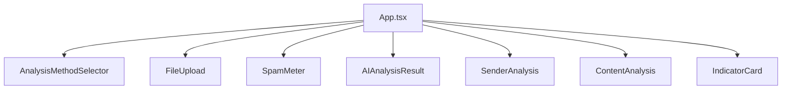

# 🛡️ SpamGuard - Email Security Scanner

<div align="center">


[](https://reactjs.org/)
[](https://www.typescriptlang.org/)
[](https://tailwindcss.com/)
[](https://vitejs.dev/)

**Advanced email security scanner with enhanced pattern detection and offline capabilities**

[🚀 Live Demo](https://your-demo-url.com) • [📖 Documentation](#documentation) • [🐛 Report Bug](https://github.com/yourusername/spamguard/issues) • [✨ Request Feature](https://github.com/yourusername/spamguard/issues)

</div>

---

## 📋 Table of Contents

- [✨ Features](#-features)
- [🎯 Key Highlights](#-key-highlights)
- [🚀 Quick Start](#-quick-start)
- [💻 Installation](#-installation)
- [🔧 Usage](#-usage)
- [🏗️ Architecture](#️-architecture)
- [🛠️ Technologies](#️-technologies)
- [📱 PWA Features](#-pwa-features)
- [🔒 Privacy & Security](#-privacy--security)
- [🎨 UI/UX Features](#-uiux-features)
- [📊 Analysis Methods](#-analysis-methods)
- [🤝 Contributing](#-contributing)
- [📄 License](#-license)
- [👨‍💻 Author](#-author)

---

## ✨ Features

### 🔍 **Dual Analysis Engine**
- **Basic Analysis**: Fast rule-based spam detection
- **Enhanced Analysis**: Advanced pattern recognition with AI-style heuristics

### 📧 **Email Input Methods**
- **Manual Input**: Direct text input for email content
- **EML File Upload**: Parse and analyze .eml email files
- **Drag & Drop**: Intuitive file upload interface

### 🛡️ **Comprehensive Security Analysis**
- **Phishing Detection**: Identifies suspicious keywords and patterns
- **Link Analysis**: Detects shortened URLs and suspicious domains
- **Sender Verification**: Domain reputation and verification checks
- **Content Analysis**: Grammar, urgency, and linguistic pattern analysis
- **Attachment Detection**: Identifies potential malicious attachments

### 📱 **Progressive Web App (PWA)**
- **Offline Capability**: Works without internet connection
- **Installable**: Can be installed on desktop and mobile devices
- **Service Worker**: Caches resources for offline use
- **Responsive Design**: Optimized for all screen sizes

---

## 🎯 Key Highlights

| Feature | Description |
|---------|-------------|
| 🔒 **Privacy First** | All processing happens locally in your browser |
| ⚡ **Lightning Fast** | Real-time analysis with instant results |
| 🌐 **Offline Ready** | Works completely offline after initial load |
| 🧠 **Smart Detection** | Advanced pattern recognition algorithms |
| 📱 **Mobile Friendly** | Responsive design for all devices |
| 🎨 **Beautiful UI** | Modern, intuitive interface with smooth animations |
| 🔧 **No Setup Required** | Ready to use out of the box |
| 📊 **Detailed Reports** | Comprehensive analysis with risk indicators |

---

## 🚀 Quick Start

### Prerequisites
- Node.js 18+ 
- npm or yarn

### Installation

```bash
# Clone the repository
git clone https://github.com/yourusername/spamguard.git

# Navigate to project directory
cd spamguard

# Install dependencies
npm install

# Start development server
npm run dev
```

### Build for Production

```bash
# Build the project
npm run build

# Preview production build
npm run preview
```

---

## 💻 Installation

### Development Setup

1. **Clone the repository**
   ```bash
   git clone https://github.com/yourusername/spamguard.git
   cd spamguard
   ```

2. **Install dependencies**
   ```bash
   npm install
   ```

3. **Start development server**
   ```bash
   npm run dev
   ```

4. **Open in browser**
   ```
   http://localhost:5173
   ```

### Production Deployment

1. **Build the project**
   ```bash
   npm run build
   ```

2. **Deploy the `dist` folder** to your hosting provider

---

## 🔧 Usage

### Basic Email Analysis

1. **Choose Analysis Method**
   - Select "Basic Analysis" for standard detection
   - Select "Enhanced Analysis" for advanced pattern recognition

2. **Input Email Data**
   - **Manual Input**: Enter sender, subject, and content
   - **File Upload**: Drag and drop .eml files

3. **View Results**
   - Spam risk score (0-100%)
   - Risk level (Safe/Suspicious/Dangerous)
   - Detailed security indicators
   - Sender and content analysis

### Sample Email Testing

Click the "Load Sample" button to test with a pre-loaded phishing email example.

### File Upload Support

- Supports `.eml` files (RFC 822 format)
- Automatic parsing of headers and content
- Secure local processing

---

## 🏗️ Architecture

### Project Structure

```
spamguard/
├── public/                 # Static assets
│   ├── manifest.json      # PWA manifest
│   ├── sw.js             # Service worker
│   └── icons/            # App icons
├── src/
│   ├── components/       # React components
│   │   ├── SpamMeter.tsx
│   │   ├── AnalysisMethodSelector.tsx
│   │   ├── AIAnalysisResult.tsx
│   │   ├── FileUpload.tsx
│   │   └── ...
│   ├── utils/           # Utility functions
│   │   ├── spamDetection.ts
│   │   ├── aiAnalysis.ts
│   │   └── emlParser.ts
│   ├── types/           # TypeScript types
│   ├── hooks/           # Custom React hooks
│   └── App.tsx          # Main application
└── ...
```

### Component Architecture



---

## 🛠️ Technologies

### Core Technologies
- **React 18.3.1** - UI framework
- **TypeScript 5.5.3** - Type safety
- **Vite 5.4.2** - Build tool and dev server
- **Tailwind CSS 3.4.1** - Styling framework

### Libraries & Tools
- **Lucide React** - Icon library
- **ESLint** - Code linting
- **PostCSS** - CSS processing
- **Autoprefixer** - CSS vendor prefixes

### PWA Technologies
- **Service Worker** - Offline caching
- **Web App Manifest** - App installation
- **Cache API** - Resource caching

---

## 📱 PWA Features

### Installation
- **Desktop**: Install via browser's install prompt
- **Mobile**: Add to home screen functionality
- **Offline Access**: Full functionality without internet

### Service Worker Capabilities
- **Resource Caching**: Static assets cached for offline use
- **Background Sync**: Future enhancement for background processing
- **Push Notifications**: Ready for future implementation

### Manifest Features
```json
{
  "name": "SpamGuard - Email Security Scanner",
  "short_name": "SpamGuard",
  "display": "standalone",
  "theme_color": "#2563eb",
  "background_color": "#ffffff"
}
```

---

## 🔒 Privacy & Security

### Data Protection
- ✅ **Local Processing**: All analysis happens in your browser
- ✅ **No Data Transmission**: Emails never leave your device
- ✅ **No Server Storage**: No data stored on external servers
- ✅ **No Tracking**: No analytics or user tracking
- ✅ **Open Source**: Transparent and auditable code

### Security Features
- **XSS Protection**: Sanitized input handling
- **Content Security Policy**: Prevents malicious script injection
- **Secure Headers**: Security-focused HTTP headers
- **Input Validation**: Comprehensive input sanitization

---

## 🎨 UI/UX Features

### Design Principles
- **Apple-level Aesthetics**: Clean, sophisticated design
- **Intuitive Navigation**: User-friendly interface
- **Responsive Design**: Works on all screen sizes
- **Accessibility**: WCAG compliant design

### Interactive Elements
- **Smooth Animations**: Micro-interactions and transitions
- **Hover States**: Interactive feedback
- **Loading States**: Clear progress indicators
- **Error Handling**: User-friendly error messages

### Color System
- **Primary**: Blue (#2563eb)
- **Success**: Green (#10b981)
- **Warning**: Yellow (#f59e0b)
- **Danger**: Red (#ef4444)
- **Neutral**: Gray scale

---

## 📊 Analysis Methods

### Basic Analysis
- **Rule-based Detection**: Traditional spam filtering
- **Keyword Matching**: Suspicious word identification
- **Domain Verification**: Sender reputation checking
- **Link Analysis**: URL safety assessment

### Enhanced Analysis
- **Pattern Recognition**: Advanced heuristic algorithms
- **Sentiment Analysis**: Emotional manipulation detection
- **Linguistic Analysis**: Grammar and translation artifacts
- **Domain Reputation**: Advanced domain scoring
- **Social Engineering**: Psychological tactic detection

### Analysis Metrics
- **Spam Score**: 0-100% risk assessment
- **Confidence Level**: Analysis reliability indicator
- **Risk Categories**: Phishing, spam, legitimate classification
- **Detailed Indicators**: Specific threat explanations

---

## 🤝 Contributing

We welcome contributions! Please see our [Contributing Guidelines](CONTRIBUTING.md) for details.

### Development Workflow

1. **Fork the repository**
2. **Create a feature branch**
   ```bash
   git checkout -b feature/amazing-feature
   ```
3. **Make your changes**
4. **Run tests and linting**
   ```bash
   npm run lint
   ```
5. **Commit your changes**
   ```bash
   git commit -m 'Add amazing feature'
   ```
6. **Push to the branch**
   ```bash
   git push origin feature/amazing-feature
   ```
7. **Open a Pull Request**

### Code Style
- Follow TypeScript best practices
- Use Tailwind CSS for styling
- Maintain component modularity
- Write descriptive commit messages

---

## 📄 License

This project is licensed under the MIT License - see the [LICENSE](LICENSE) file for details.

---

## 👨‍💻 Author

**Faqih Yugos**
- 🌐 LinkedIn: [faqihyugos](https://www.linkedin.com/in/faqihyugos/)
- 📧 Email: [your-email@example.com]
- 🐙 GitHub: [@yourusername]

---

<div align="center">

### 🌟 Star this repository if you find it helpful!

**Made with ❤️ for email security and privacy**

[⬆ Back to Top](#️-spamguard---email-security-scanner)

</div>

---

## 📈 Roadmap

### Upcoming Features
- [ ] **Machine Learning Integration**: Real ML model integration
- [ ] **Email Header Analysis**: Deep header inspection
- [ ] **Bulk Email Analysis**: Process multiple emails
- [ ] **Export Reports**: PDF/CSV export functionality
- [ ] **Custom Rules**: User-defined detection rules
- [ ] **API Integration**: Optional cloud-based analysis
- [ ] **Browser Extension**: Chrome/Firefox extension
- [ ] **Mobile App**: Native mobile applications

### Performance Improvements
- [ ] **Web Workers**: Background processing
- [ ] **Lazy Loading**: Component optimization
- [ ] **Bundle Splitting**: Improved loading times
- [ ] **Memory Optimization**: Enhanced performance

---

## 🔧 Configuration

### Environment Variables
```env
# Optional: Custom configuration
VITE_APP_NAME=SpamGuard
VITE_APP_VERSION=1.0.0
```

### Build Configuration
The project uses Vite with optimized build settings:
- **Code Splitting**: Vendor and icon chunks
- **Tree Shaking**: Unused code elimination
- **Minification**: Production optimization
- **Source Maps**: Development debugging

---

## 🐛 Troubleshooting

### Common Issues

**Issue**: App not loading offline
**Solution**: Ensure service worker is registered and cache is populated

**Issue**: EML file not parsing
**Solution**: Verify file format and encoding (UTF-8 recommended)

**Issue**: Analysis not working
**Solution**: Check browser console for JavaScript errors

### Browser Support
- ✅ Chrome 90+
- ✅ Firefox 88+
- ✅ Safari 14+
- ✅ Edge 90+

---

## 📞 Support

Need help? Here's how to get support:

1. **Check Documentation**: Review this README and inline comments
2. **Search Issues**: Look through existing GitHub issues
3. **Create Issue**: Open a new issue with detailed description
4. **Community**: Join our discussions for community support

---

*Last updated: January 2025*